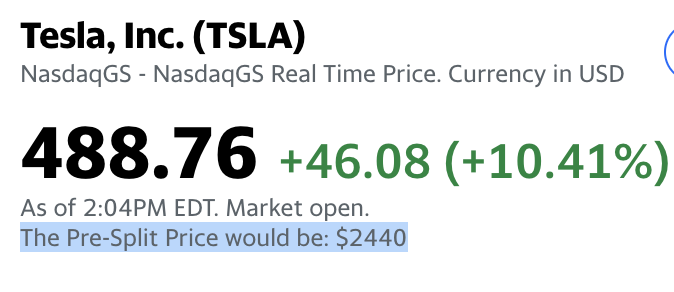

# Chrome Extension to show $TSLA's'(Tesla's) Stock price pre 5-1 split

This is a google chrome extension that adds 'The Pre-Split Price would be: XXXXX' to your Yahoo Finance webpage and shows you in real time, what the price would have been before the stock split. There is a crazy complex algorithm used here(current price * 5);

## Installation

Until this is on the Google Chrome Extension Store, you will have to download the code and add it to your browser.
enable Chrome developer mode & preview extension

Navigate to https://finance.yahoo.com/quote/TSLA/history?p=TSLA to try it out.

I followed this Chrome Extension Guide
https://9to5google.com/2015/06/14/how-to-make-a-chrome-extensions/
